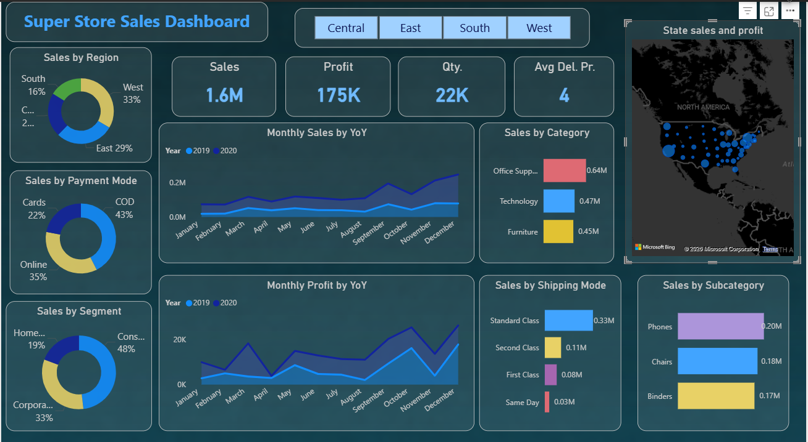

# Superstore Sales & Profit Dashboard (Power BI)

## Overview
This project presents an interactive Power BI dashboard analyzing Superstore sales data to uncover insights on revenue, profitability, customer behavior, and regional performance.

## Tools Used
- Power BI  
- DAX  
- Data Visualization  

## Key Features
- KPI tracking: Sales, Profit, Quantity, Avg Delivery Time  
- Monthly Sales & Profit trend analysis (YoY)  
- Category and Sub-category performance analysis  
- Regional and geographical insights using map visualization  
- Customer segmentation and payment mode analysis  

## Key Insights
- Total sales reached **1.6M** with a profit of **175K**  
- Furniture category shows **high sales but low profit margins**  
- West region contributes the highest revenue  
- Higher discounts negatively impact profitability  
- A few sub-categories drive the majority of total sales  

## Dashboard Preview

## 📁 Project Structure
